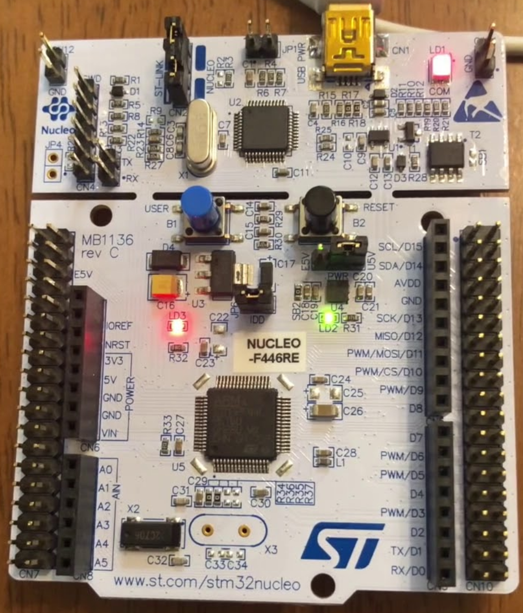

# Примеры кода на Rust для программирования микроконтроллеров STM32

Этот репозиторий содержит простые примеры кода на языке программирования Rust для микроконтроллеров STM32 на примере платы **[NUCLEO-F446RE (STM32F446RET6)](https://www.st.com/en/evaluation-tools/nucleo-f446re.html)**.

## Плата

<table>
    <tr>
        <td>
            
        <td>
        <td>
            <ul><li>Микроконтроллер STM32 в корпусе QFP6</li><li>Два типа дополнительных разъемов:<ul><li>Совместимые с Arduino Uno V3</li><li>Разъемы расширения ST Morpho обеспечивающие полный доступ ко всем входам/выходам STM32.</li></ul></li><li>Встроенный отладчик/программатор ST-LINK/V2-1 с SWD-коннектором</li><li>Гибкий источник питания для печатных плат:<ul><li>USB VBUS или внешний источник (3,3В, 5В, 7–12В)</li><li>Точка доступа управления питанием</li></ul></li><li>Три светодиода: светодиод связи USB (LD1), светодиод пользователя (LD2), светодиод питания (LD3)</li><li>Две кнопки: USER и RESET.</li></ul>
        <td>
    </tr>
</table>

## Аппаратные характеристики платы

- STM32F446RET6 in LQFP64 package
- ARM® 32-bit Cortex®-M4 CPU with FPU
- Adaptive real-time accelerator (ART Accelerator)
- 180 MHz max CPU frequency
- VDD from 1.7 V to 3.6 V
- 512 KB Flash
- 128 KB SRAM
- 10 General purpose timers
- 2 Advanced control timers
- 2 basic timers
- SPI(4)
- I2C(3)
- USART(4)
- UART(2)
- USB OTG Full Speed and High Speed
- CAN(2)
- SAI(2)
- SPDIF_Rx(1)
- HDMI_CEC(1)
- Quad SPI(1)
- Camera Interface
- GPIO(50) with external interrupt capability
- 12-bit ADC(3) with 16 channels
- 12-bit DAC with 2 channels